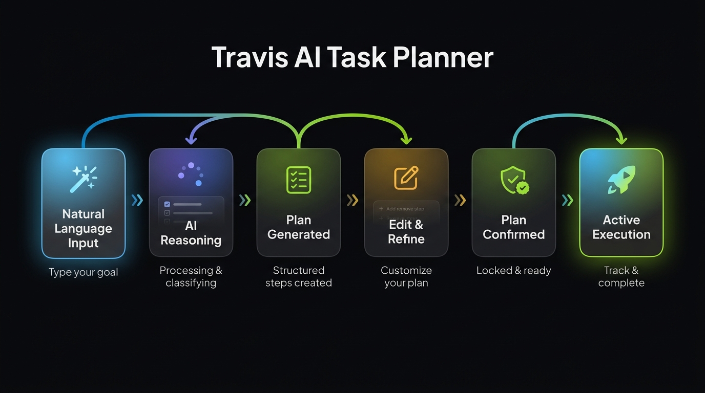

# Travis AI Task Planner

A full-page AI-powered Task Planner web application designed for **Travis AI**. Built with React 19, TypeScript 5, and modern UI design principles matching the brand aesthetic of Travis.

  

**Live Demo: [https://travis1.netlify.app](https://travis1.netlify.app)**

---

## App User Flow



> **6-stage journey**: Natural Language Input → AI Reasoning → Plan Generated → Edit & Refine → Plan Confirmed → Active Execution.

---

## Key Features & Core Flow Alignment

The application strictly implements and satisfies the complete **Section 3 Core User Flow (Steps 1–8)** as requested:

1. **Natural Language Input & Example Suggestions**:
   - Clean, elevated prompt textarea featuring an AI sparkle icon and inline validation for empty/whitespace submissions.
   - 4 prompt presets covering **Mobile App Launch**, **Design System & UI**, **Q4 Growth Strategy**, and **Tech Stack Upgrade**.
   - **Plan Style Selection Dropdown**: Supports `Standard Plan`, `Detailed Roadmap`, and `Agile Sprints`.

2. **Multi-Stage AI Reasoning State (Loading View)**:
   - Dynamic progress stepper showcasing simulated multi-stage reasoning: `Parsing Prompt → Synthesizing Tasks → Structuring Hierarchy → Finalizing Roadmap`.
   - Real-time step duration timer, progress indicator, and skeleton loading cards.

3. **Structured Plan View & Progressive Disclosure**:
   - Displays plan title, badge, description, and interactive progress bar (`X of Y steps completed`).
   - Clean step cards with visual hierarchy (Title first, Description second, Controls last), day estimates, and custom vector SVG icons.
   - Individual step collapse/expand + global **Expand All / Collapse All** control.

4. **Inline Step Editing & First-Class Interaction States**:
   - Click on any task title or description to edit text inline.
   - Active edit mode features a distinct sky border highlight (`#0284c7`), blue tint, and `Editing mode` banner chip.

5. **Dynamic Item Management & Undo Toast Notification**:
   - Add new custom action items with **"Add Custom Plan Item"**.
   - Delete unwanted steps with an instant bottom-floating **Undo Toast Banner** (5-second countdown progress bar with 1-click restore).
   - Rich illustrated empty state card when 0 action items exist.

6. **Plan Confirmation Action & Locked Execution Mode**:
   - High-visibility primary CTA button: **`Confirm & Activate Plan →`** anchored at the bottom of the plan card.
   - Transition from review mode to **Active Execution Mode (Locked Styling)** featuring a glowing green `LIVE EXECUTION (LOCKED)` badge, active progress bar, and locked inline edits.

7. **Success & Confirmation State Screen**:
   - Detailed summary card showing all approved tasks and estimated timelines.
   - Quick action controls: **Copy Plan Summary to Clipboard**, **Export Plan as JSON**, and **Create Another Plan**.

8. **Dynamic Sidebar History**:
   - Automatically appends newly generated plans to the **"Today"** group in the collapsible sidebar.
   - Persists history state across browser reloads via `localStorage`.

---

## Visual Design & Aesthetics

- **Hero Glass Orb & Fluid Dynamics**: 3D translucent glass orb header with rotating internal blue fluid waves (`#0284c7`, `#38bdf8`, `#818cf8`), specular light highlights, and ambient glow.
- **Collapsible History Sidebar**: Smooth ChatGPT/Claude-style drawer featuring grouped chat history (Today, Yesterday, Last 7 Days), custom SVG branding, quick actions, delete/clear options, and collapsible layout.
- **Zero Scrollbar Policy**: Custom CSS rule hiding browser scrollbars across all scrollable containers (`.planner-page-main`, `.planner-sidebar-scroll`) while keeping smooth scrolling intact.
- **Color Palette & Typography**:
  - Primary Accent: `#0284c7` (Sky Blue) & `#84cc16` (Lime Accent)
  - Dark Neutral: `#08090c`
  - Off-white Background: `#fbfbfd` with subtle radial gradient mesh
  - Typography: `Plus Jakarta Sans`

---

## Architecture & Project Structure

```
frontend/src/
├── assets/                          # Static image/SVG assets
├── components/                      # Domain-grouped UI component modules
│   ├── landing/                     # Landing Page feature components & styles
│   │   ├── BentoSection.jsx (.css)
│   │   ├── CtaFooterSection.jsx (.css)
│   │   ├── DifferentShapeSection.jsx (.css)
│   │   ├── FaqScrollSection.jsx (.css)
│   │   ├── LandingPage.jsx (.css)
│   │   ├── PacksSection.jsx (.css)
│   │   └── Preloader.jsx (.css)
│   └── planner/                     # Travis AI Task Planner feature components
│       ├── TravisPlannerPage.tsx    # Parent workspace page container
│       ├── PlannerHeader.tsx        # Hero 3D glass orb & page title
│       ├── PlannerSidebar.tsx       # Dynamic chat history sidebar with localStorage
│       ├── PromptInput.tsx          # Input card, toolbar, plan style & validation
│       ├── StepCard.tsx             # Step card with visual weight, inline editing & collapse
│       ├── PlanView.tsx             # Main plan container, rich empty state, & Confirm CTA
│       ├── LoadingState.tsx         # Multi-stage reasoning stepper & skeleton loader
│       ├── ErrorState.tsx           # Error state card with diagnostic code & retry CTA
│       ├── SuccessConfirmation.tsx  # Confirmed plan screen with JSON export & copy summary
│       └── PlannerModal.css         # Complete styling, keyframes, & hidden scrollbars
├── hooks/
│   └── usePlanPlanner.ts            # Central state machine hook & history persistence
├── services/
│   └── mockPlanApi.ts               # Decoupled mock API service with prompt classification
└── types/
    └── plan.ts                      # TypeScript interfaces for PlanData, PlanStep, & HistoryItem
```

---

## How to Run Locally

1. **Install Dependencies**:
   ```bash
   cd frontend
   npm install
   ```

2. **Start Development Server**:
   ```bash
   npm run dev
   ```
   Open `http://localhost:5173` in your browser.

3. **Build for Production**:
   ```bash
   npm run build
   ```

---

## Key Technical & Design Decisions

- **Decoupled Asynchronous Mock API (`mockPlanApi.ts`)**: Kept separate from UI code using clean TypeScript interfaces (`PlanData`, `PlanStep`), ensuring realistic async latency simulation and keyword classification.
- **Centralized State Machine Hook (`usePlanPlanner.ts`)**: Managed all state transitions (Prompting → Loading → Reviewing → Confirmed / Error / Empty) cleanly in a reusable custom hook.
- **Full-Screen SaaS Workspace Experience**: Architected as a full-page app with a collapsible sidebar drawer (Claude / ChatGPT style) rather than a cramped modal dialog.

---

## Assumptions & Trade-offs

- **Landing Page Scope**: Built a full marketing landing page beyond the core requirement to demonstrate broader product and brand design range; top navigation links (*Products*, *Pricing*, *FAQ*, *Sign in*) are non-functional placeholders — the **Task Planner workspace itself** is the core deliverable being evaluated.
- **Step Completion Tracking vs. Plan Confirmation**: Confirming a plan is distinct from completing its steps. Confirmation locks the plan into an active execution state; step checkboxes track execution progress independently and are not auto-completed by confirmation.
- **Fallback Plan Generation**: Any natural language prompt not matching the 4 preset keywords (`launch`, `design`, `marketing`, `tech`) falls through to a generic templated plan personalized with the user's raw prompt text (in the title, description, and steps) rather than failing. This ensures unpredictable user input is handled gracefully without unexpected API errors.
- **Workspace History Persistence**: Chat history is persisted in `localStorage` per browser session rather than synchronized with a multi-tenant backend database.

---

## What I Would Improve With More Time

1. **Focus Engineering Effort Entirely on Core Workspace**: Shift time spent on marketing landing pages into deepening the planner workspace (e.g., nested subtasks, live SSE streaming, and team collaboration).
2. **Deepen Accessibility Compliance**: Conduct a rigorous WCAG AA audit covering full keyboard navigation through step cards, focus-visible outlines, and contrast verification on muted secondary text.
3. **Expand Mobile & Narrow Viewport Responsive Verification**: Further refine drawer collapsing gestures and touch targets for mobile viewports below 480px.
4. **Wire Attachment & Dropdown Affordance Depth**: Expand the "Attach" button to support document context parsing (e.g. uploading a PRD or spec document to extract plan items).
5. **Drag-and-Drop Step Reordering**: Integrate `@hello-pangea/dnd` to allow users to visually reorder plan action items via grip handles.
6. **PDF / Markdown Export**: Expand export features beyond JSON to include one-click PDF generation and formatted GitHub Markdown downloads.
